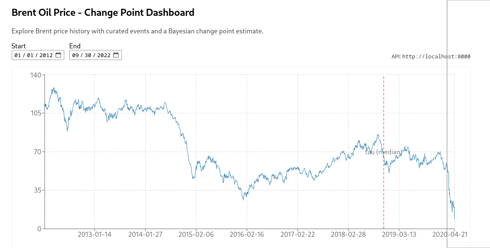
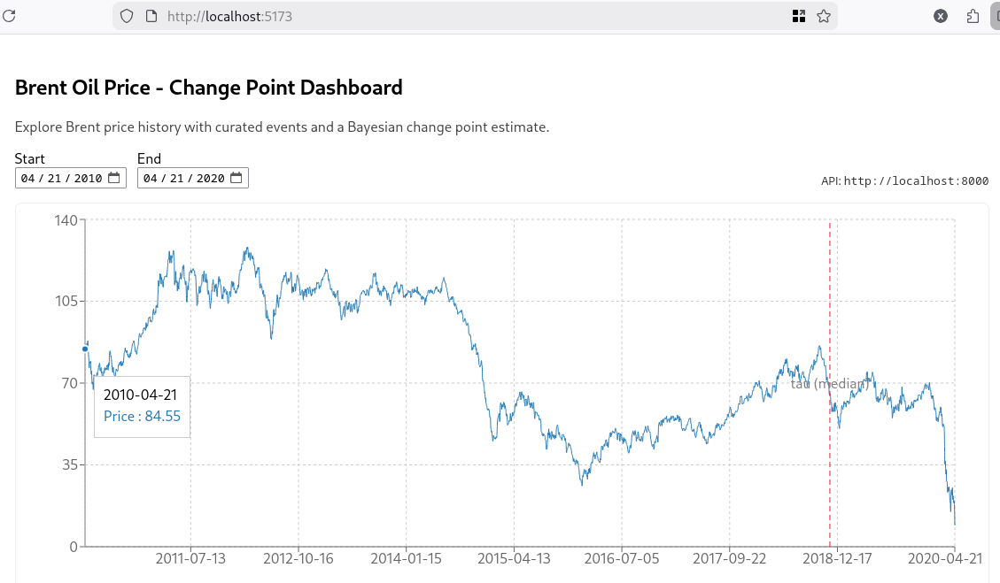
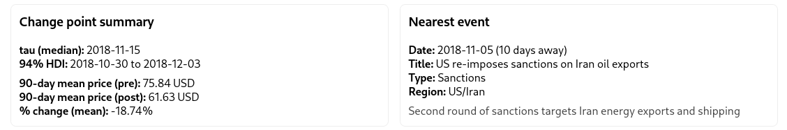
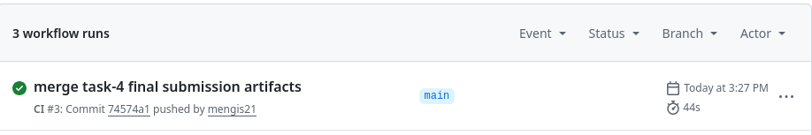

# Final Report - Brent Oil Regime Shift Risk Analytics (Week 12 Capstone)

**Student:** Kidus Gebremedhin  
**Repository:** https://github.com/mengis21/Improving-W11-finance-risk-brent-changepoint  
**Date:** 2026-02-17

## 1) Business Problem

Financial analysts and risk teams need to identify market regime shifts early so they can adjust exposure, hedging, and scenario assumptions before losses compound. Brent oil prices are highly sensitive to geopolitical and policy shocks, but the timing and persistence of structural breaks are often interpreted manually and inconsistently. This capstone turns the process into a transparent, testable analytics workflow suitable for finance-sector decision support.

## 2) Solution and Design

The solution combines a Bayesian change point model with engineering reliability improvements.

- Data pipeline: load and clean Brent daily prices and curated oil-market events.
- Feature pipeline: convert price levels to log returns and validate stationarity.
- Modeling: infer a posterior distribution for a single structural break with pre/post mean and volatility regimes.
- Interpretation: map inferred break timing to nearest known geopolitical event.
- Delivery: expose outputs via API and visualize through dashboard.

## 3) Week 12 Improvements Implemented

### 3.1 Engineering and quality

- Added automated tests for core modules (`10` tests passing).
- Added CI pipeline (`.github/workflows/ci.yml`) to run tests on push/PR.
- Refactored `src/changepoint.py` to avoid hard imports of heavy dependencies during utility-only paths.

### 3.2 Documentation and communication

- Upgraded README to include business framing, quick start, metrics, and project structure.
- Added progress and final-submission documentation under `docs/`.

## 4) Key Results

From `models/changepoint_summary.json`:

- Posterior median change point date: **2018-11-15**
- 94% HDI for change point date: **2018-10-30 to 2018-12-03**
- Nearest event: **2018-11-05, US re-imposes sanctions on Iran oil exports** (`abs_days = 10`)
- 90-day mean Brent price window shift:
  - Pre: **75.84 USD**
  - Post: **61.63 USD**
  - Change: **-18.74%**

These results support a plausible temporal association between a market-relevant geopolitical event and a regime shift in Brent behavior.

## 5) Reliability Evidence

- Local test run on main branch: `10 passed`.
- CI workflow added to automate regressions checks.
- Modular codebase and reproducible setup documented in README.

## 6) Screenshots of Additional Work (Required for Final)

Add screenshots to `docs/screenshots/` with these exact filenames:

1. `dashboard_overview.png` - full dashboard view
2. `dashboard_last_decade_filter.png` - filtered date range view
3. `dashboard_event_changepoint_context.png` - event/changepoint interpretation view
4. `github_actions_ci_success.png` - CI run success in GitHub Actions
5. `pytest_terminal_10_passed.png` - terminal evidence of passing tests

Embed screenshots below before PDF export:

## 7) Link to Code

- Main repository: https://github.com/mengis21/Improving-W11-finance-risk-brent-changepoint
- Interim branches (proof of work):
  - https://github.com/mengis21/Improving-W11-finance-risk-brent-changepoint/tree/task-1-testing-refactor
  - https://github.com/mengis21/Improving-W11-finance-risk-brent-changepoint/tree/task-2-ci-readme
  - https://github.com/mengis21/Improving-W11-finance-risk-brent-changepoint/tree/task-3-interim2-report

## 8) Finance Audience Impact Summary

This project improves decision-readiness by combining probabilistic regime detection, transparent event context, and engineering quality controls. It reduces operational risk from ad-hoc analysis by making data prep, inference, and communication reproducible and testable.

## 9) References

- Pytest Documentation. https://docs.pytest.org/
- GitHub Actions - Building and testing Python. https://docs.github.com/en/actions/use-cases-and-examples/building-and-testing/building-and-testing-python
- PEP 484 - Type Hints. https://peps.python.org/pep-0484/
- PyMC Documentation. https://www.pymc.io/projects/docs/en/stable/
- ArviZ Documentation. https://python.arviz.org/
- FRED: Crude Oil Prices - Brent (DCOILBRENTEU). https://fred.stlouisfed.org/series/DCOILBRENTEU
